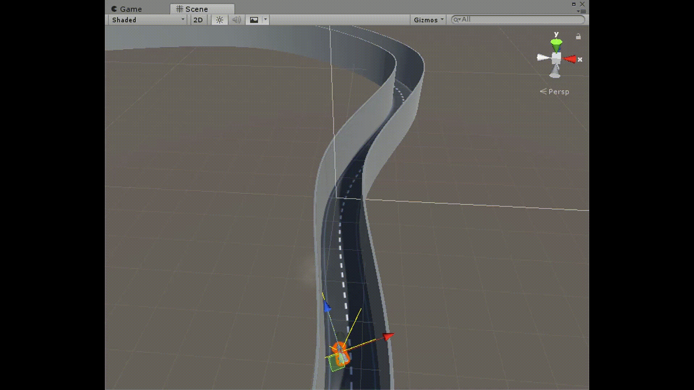

# SelfDrivingCar-GeneticAlgo-Unity
Car trained using genetic algorithm in Unity Engine

---

## Prerequisites
Steps:

1. Import car from standard assets in Unity.
2. Attach CustomCarController.cs to it.
3. Create empty game object and attach Nature.cs
4. Drag car from scene to the variable of Nature.cs in the inspector panel.
5. Create UI with two text objects.
6. Drag one into PopulationText variable of Nature.cs and another on StatsText of CustomCarController.cs
7. To save best NN, place an empty collider behind the car. Make sure that isTrigger is checked.
8. The finish object should have tag set to "Finish"
9. The walls of the track should have tag set to "Wall"
10. Change speed limit of the Car to tune training.

---

## TO-DO
- [ ] Matrix class
- [ ] Test on unknown track
- [ ] Parallel Training
- [ ] Ability to speedup training
- [ ] Optimize bias and weight ranges

---

## Known Issues
- The matrix multiplication is hard coded. Needs to be changed